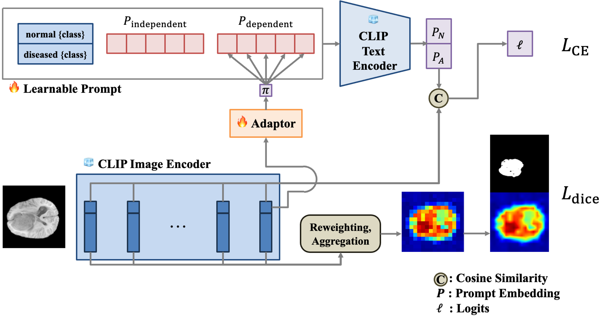

# CLUE: Conditional Prompt Learning for Anomaly Detection in Medical Image Slices
Project at FMISL, SNU

[ [Paper](https://github.com/kdh-yu/CLUE/tree/main/files/Paper_imed.pdf) ]
[ [Poster]((https://github.com/kdh-yu/CLUE/tree/main/files/Poster_DohoonKim.pdf)) ]

